# System Architecture

Enthusiast contains of two main components:

1. Server - A Python-based server, that contains the core application logic. It's deployed as two separate components
    - API - responsible for handling requests from the frontend or other applications connected to Enthusiast via an API.
    - Worker - that executes agent requests and synchronization tasks in the background.
2. Frontend - A React-based web application that can be used to use and configure Enthusiast.

## Server Architecture

The server is organized into a few separate modules that interact with each other:

1. Agent - responsible for managing agent's state and orchestrating agentic workflows
2. Catalog - manages processes of indexing product and document data
3. Sync - tracks catalog synchronization status
4. Account - handles user permissions and authentication

## Enthusiast Common

The [enthusiast-common](https://github.com/upsidelab/enthusiast/tree/main/plugins/enthusiast-common) package provides interfaces that can be used for building custom agents and plugins, without pulling the whole server implementation to your codebase. 
We recommend building your custom agents and plugins as custom packages, that depend on enthusiast-common, and are installed inside Enthusiast. This will make it easy to upgrade the core of the system in the future.
