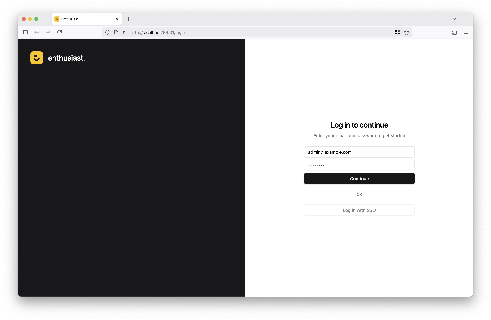

# Installation

Launch Enthusiast effortlessly using the provided Docker Compose configuration, with a working instance.

## Prerequisites

* Docker and Docker Compose installed on your system, check [Docker installation instructions](https://docs.docker.com/get-started/get-docker/) for the installation.
* Your [OpenAI API key](https://platform.openai.com/api-keys) with access to the **gpt-4.1** model (or at least the **gpt-4o** model).

## Installation and Setup

1. Clone the starter repository:

   ```bash
   git clone https://github.com/upsidelab/enthusiast-starter
   ```

2. Copy the environment sample file to prepare the configuration:

   ```bash
   cp config/env.sample config/env
   ```

3. Add Your OpenAI API key:
   * Open the `config/env` file in a text editor.
   * Paste the OpenAI API key to the `OPENAI_API_KEY` field.

   ```shell
   OPENAI_API_KEY=sk-XXXXXXXXXXXXXXXXXXXXXXX
   ```

### Set Admin Email and Password

Change the default admin login credentials in the `config/env`, set these values in your environment file before starting:

```shell
ECL_ADMIN_EMAIL=admin@example.com
ECL_ADMIN_PASSWORD=changeme
```

## Running the application

Build and start Enthusiast using Docker Compose:

For **macOS** and **Linux**:

```bash
docker compose build && docker compose up
```

For Windows:

```bash
docker-compose build
docker-compose up
```

### Accessing the Admin Panel

Once the setup is complete, you can access the application UI at [`http://localhost:10001`](http://localhost:10001).

Sign in using the default admin account:

* **Email**: <admin@example.com> (or your custom value)
* **Password**: changeme (or your custom value)



> **Recommendation**:
> For better security, change your password right after logging in for the first time.

## Troubleshooting

If you encounter any issues:

* Ensure Docker and Docker Compose are running.
* Check your OpenAI API key is valid and model access is sufficient.
* Make sure no other process uses port [`http://localhost:10001`](http://localhost:10001).
* Review error messages in the Docker logs for clues.

### Getting Help

For additional support, visit the project’s [GitHub Issues page](https://github.com/upsidelab/enthusiast-starter/issues).
