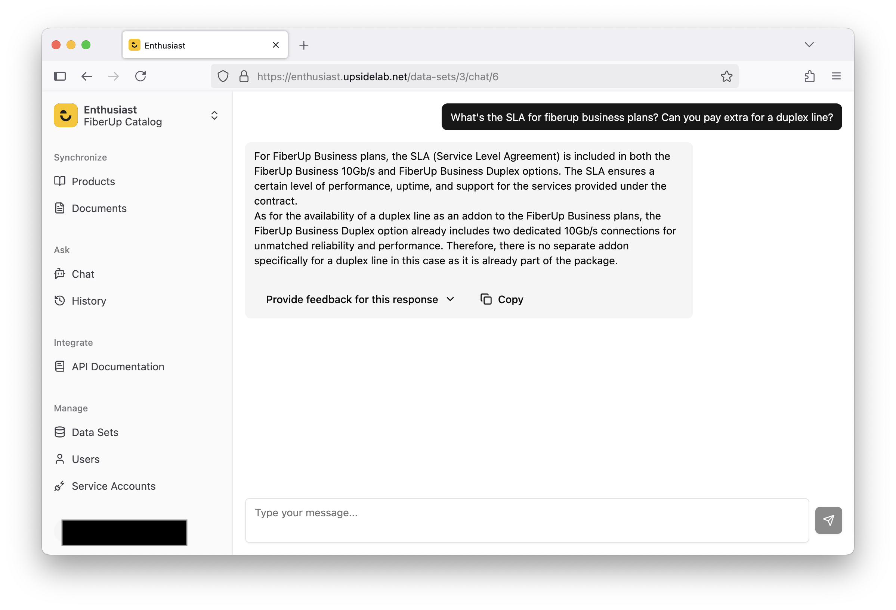

# Introduction

Enthusiast is an open-source AI agent that helps e-commerce teams scale support, sales, and marketing with minimal setup. Connect it to your product catalog, add content that describes your products and brand, and scale your team's capabilities.

## Core Features

* Pre-built integrations with leading e-commerce platforms for rapid deployment.

* Built on a reliable Python/Django/PostgreSQL/React technology stack.

* Supports both OpenAI-hosted and self-hosted large language models, offering flexibility and control.

* Open-source nature allows customization and prompt tuning according to your needs.

## Use Cases

* **Internal Knowledge Base**: For companies with complex catalogs Enthusiast provides sales teams with comprehensive, easy-to-navigate product information for complex catalogs.

* **Customer Support**: (Semi-)automate responses to customer inquiries by utilizing relevant product data.

* **Content Creation**: Generate marketing materials such as newsletters, blog posts, and ads. Enthusiast acts as a marketer, creating content at scale from day one.

* **Product Recommendations**: Enable users to ask natural language queries and receive tailored product suggestions.

* **Content Moderation and Validation**: Automatically ensure accuracy and quality of new content and customer reviews.

## Try It Out

Check our [Getting Started guide](/docs/getting-started/installation/) to set up an Enthusiast instance locally and see the platform in action.
