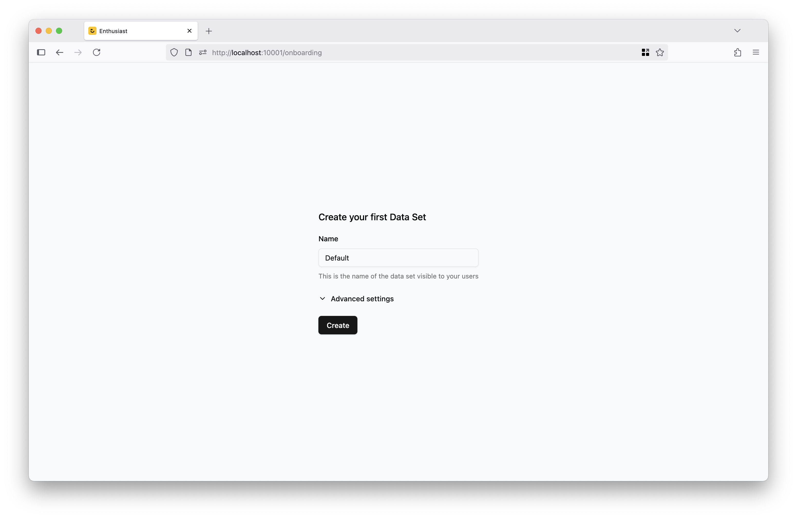
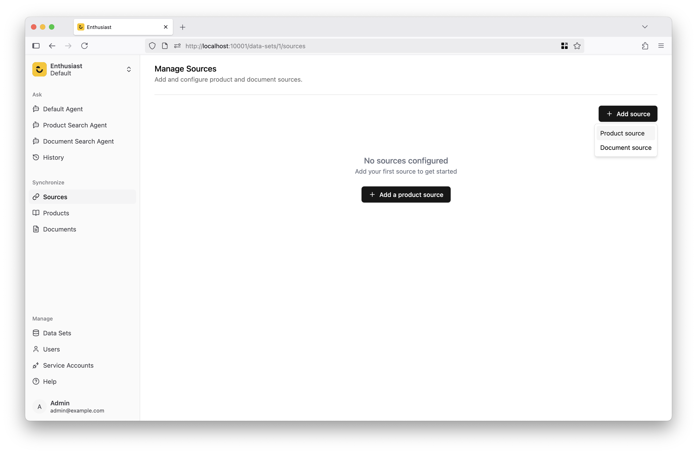
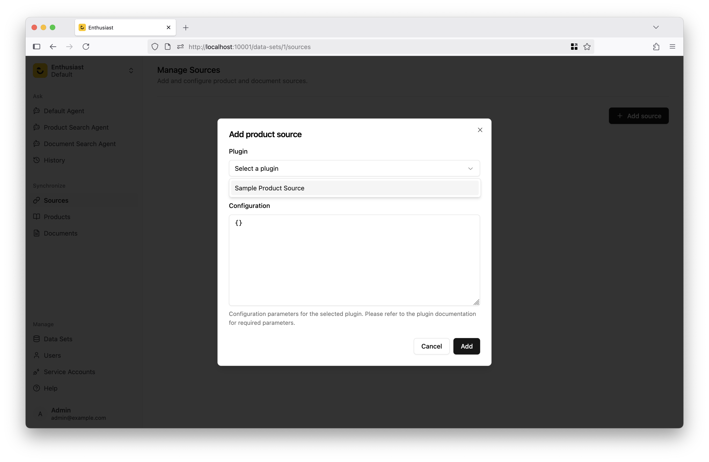
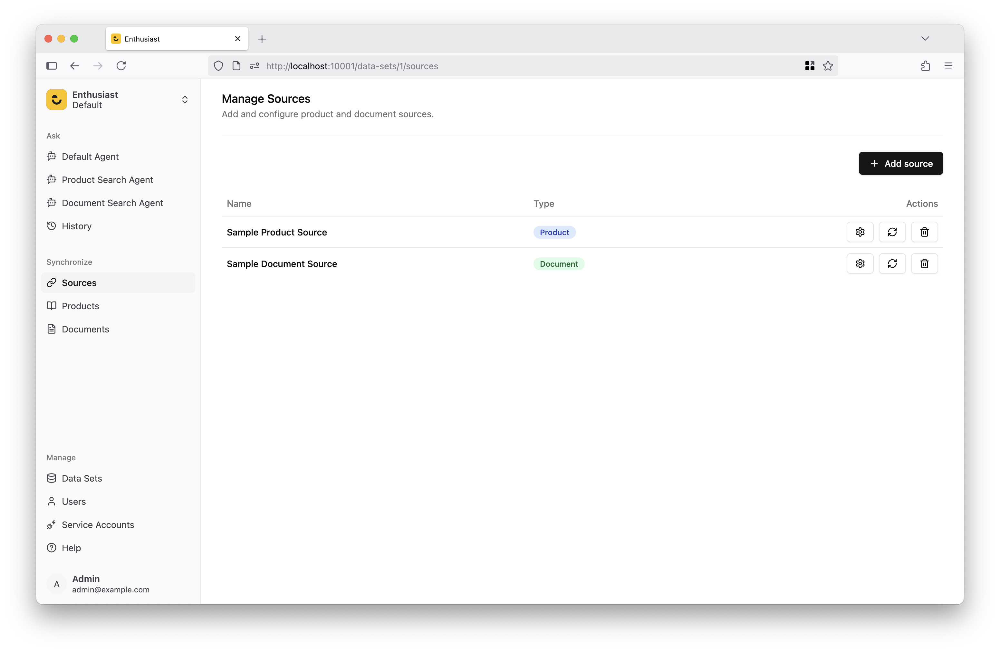
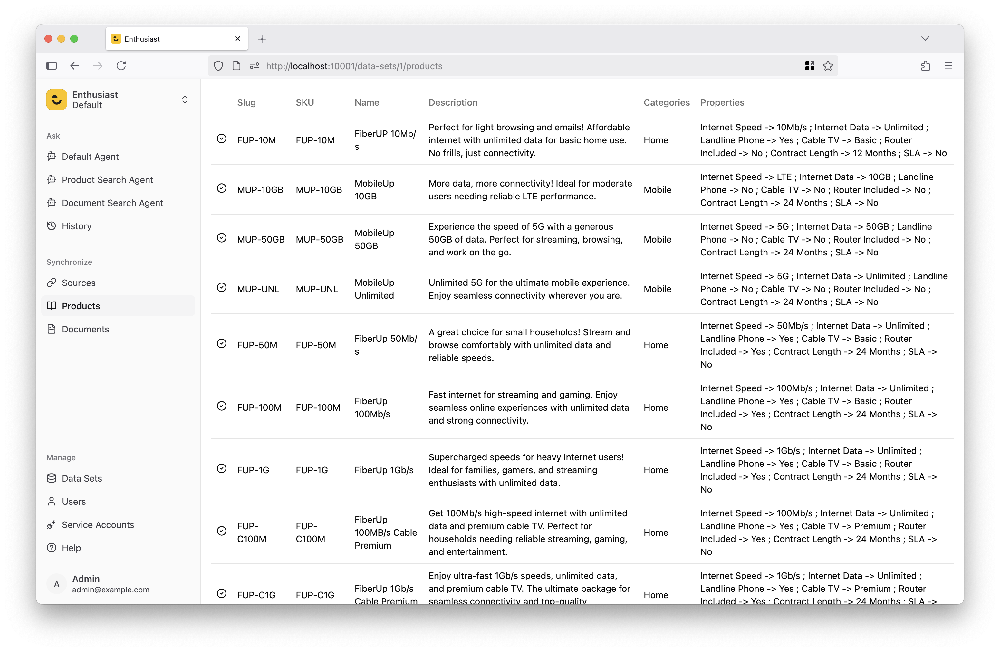

# Importing Test Data

When you sign in to Enthusiast for the first time, you’ll be prompted to create your first [data set](/docs/synchronize/manage-data-sets).

Pick a name for your data set and click “Create”. This will take you to a screen where you can configure data sources.

## Configuring Data Sources

Data sources provide product and document catalog, that's then pulled into Enthusiast and indexed. This index can then be easily used by the AI agents for looking up information needed to fulfill the requests passed to the agent.
Data sources can be synchronized on-demand, or according to a defined schedule.

Let's configure a sample data source for products and documents, to feed our agents with knowledge.

Enthusiast comes with a set of [plugins](/docs/category/plugins), that make it easy to pull information from popular E-Commerce, PIM and CMS systems.
It also provides a sample source for products and documents, that can be used to get started quickly.

Click on "Add Source" in the top right corner of the screen. From the dropdown menu select "Product source". A popup will appear on the screen, allowing you to configure the source.

Select “Sample Product Source” from the list and click “Add”. You will now see in the list of configured sources.
Repeat the same process for the document source, this time selecting "Sample Document Source" as the source type.

Your source configuration will now look like in the screenshot above. By default, sources are configured to synchronize manually.
Click on the "Sync" button next to each source to synchronize it and import data into Enthusiast.

## Verifying Synchronization Status

After triggering the synchronization, go to the “Products” tab in the left menu and check that the products appear in the list. Repeat this step for documents.

Now, it's the time to start to [try out your agent](/docs/getting-started/chat-with-agent).
