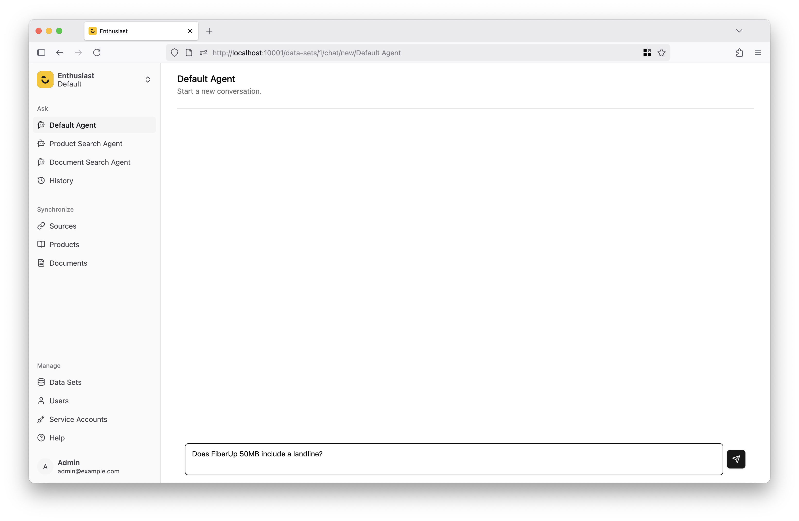

# Give It a Task

Once the test data set has been imported and indexed, you can start chatting with the agent.
The enthusiast-starter package comes with a few example agents, that are pre-configured to execute different workflows. To learn more how to build custom agents, see the [customization](/docs/customization/system-architecture/) section of the documentation.

For now, let's try the "Default Agent". This is a general purpose RAG-based agent, configured to answer user's questions based on its knowledge of products and documents imported into the system.

In the left sidebar, go to “Ask” → “Default Agent”. This will open the chat interface, where you can interact with the AI agent.

**Here are a few sample requests to try:**

> "Does the FiberUp 50 plan come with a landline phone plan?"

> "Write an ad for a FiberUp 100 special Christmas offer, that discounts the monthly price by 20% for the first year."

> "Respond to the following customer question: What channels are available in the FiberUp 50 package?"

> "Respond to the following customer question: Will I get roaming charges if I go to Switzerland with MobileUp Unlimited plan?"

## Next Steps

- [Learn more about data sets](/docs/management/data-sets)
- [See how to manage users](/docs/management/users)
- [Build your custom agent](/docs/agents/agent-architecture)
- [Create a custom plugin](/docs/plugins/create-custom-plugin)
