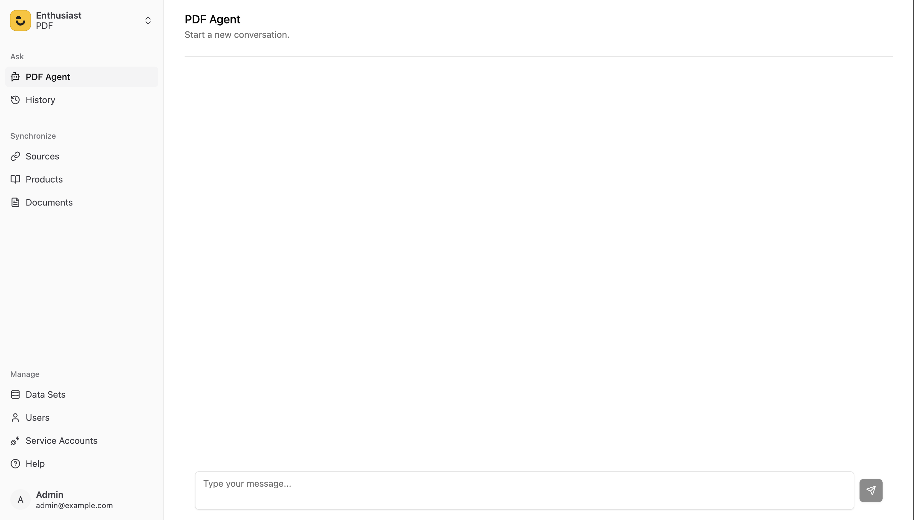

# Creating custom Agent
Custom Agent will allow to customize any part of agent providing its configuration, while enthusiast take care of building it.

## Creating a simple PDF Agent - which will answer question about pdf documents.

1. Create a directory for you agent (e.g. `pdf_agent`). Then inside it create `agent.py` file:
```python
from enthusiast_common.agents import BaseAgent
from enthusiast_common.injectors import BaseInjector
from enthusiast_common.tools.base import BaseTool
from langchain.agents import AgentExecutor, create_tool_calling_agent
from langchain_core.callbacks import BaseCallbackHandler
from langchain_core.language_models import BaseLanguageModel
from langchain_core.prompts import ChatPromptTemplate


class ExamplePDFAgent(BaseAgent):
    def __init__(
        self,
        tools: list[BaseTool],
        llm: BaseLanguageModel,
        prompt: ChatPromptTemplate,
        conversation_id: int,
        injector: BaseInjector,
        callback_handler: BaseCallbackHandler | None = None,
    ):
        super().__init__(
            tools=tools,
            llm=llm,
            prompt=prompt,
            conversation_id=conversation_id,
            callback_handler=callback_handler,
            injector=injector,
        )
        self._agent_executor = self._create_agent_executor()

    def _create_agent_executor(self, **kwargs) -> AgentExecutor:
        tools = self._create_tools()
        agent = create_tool_calling_agent(self._llm, tools, self._prompt)
        return AgentExecutor(
            agent=agent, tools=tools, verbose=True, memory=self._injector.chat_summary_memory, **kwargs
        )

    def _create_tools(self):
        return [tool_class.as_tool() for tool_class in self._tools]

    def get_answer(self, input_text: str) -> str:
        agent_output = self._agent_executor.invoke(
            {"input": input_text}, config={"callbacks": [self._callback_handler] if self._callback_handler else []}
        )
        return agent_output["output"]
```
2. Create Prompt in prompt.py file.
```python
PDF_AGENT_SYSTEM_PROMPT="""
You are a helpful agent, answering questions about pdf document. Always use context tool
"""
```

3. Create context retrieving tool:
```python
from enthusiast_common.injectors import BaseInjector
from enthusiast_common.tools import BaseLLMTool
from langchain_core.language_models import BaseLanguageModel
from pydantic import BaseModel, Field


class ContextSearchToolInput(BaseModel):
    full_user_request: str = Field(description="user's full request")


class ContextSearchTool(BaseLLMTool):
    NAME = "context_search_tool"
    DESCRIPTION = "Use it to get context from pdf required for answering questions"
    ARGS_SCHEMA = ContextSearchToolInput
    RETURN_DIRECT = False

    def __init__(
        self,
        data_set_id: int,
        llm: BaseLanguageModel,
        injector: BaseInjector,
    ):
        super().__init__(data_set_id=data_set_id, llm=llm, injector=injector)
        self.data_set_id = data_set_id
        self.llm = llm
        self.injector = injector

    def run(self, full_user_request: str):
        document_retriever = self.injector.document_retriever
        relevant_documents = document_retriever.find_content_matching_query(full_user_request)
        content  = [document.content for document in relevant_documents]

        return content
```

4. Create configuration inside `config.py` file:
```python
from enthusiast_common.config import AgentConfigWithDefaults, LLMToolConfig
from langchain_core.prompts import ChatPromptTemplate

from .tools.pdf_context_tool import ContextSearchTool
from .agent import ExamplePDFAgent
from .prompt import PDF_AGENT_SYSTEM_PROMPT


def get_config(conversation_id: int, streaming: bool) -> AgentConfigWithDefaults:
    return AgentConfigWithDefaults(
        conversation_id=conversation_id,
        prompt_template=ChatPromptTemplate.from_messages(
            [
                (
                    "system",
                    PDF_AGENT_SYSTEM_PROMPT,
                ),
                ("placeholder", "{chat_history}"),
                ("human", "{input}"),
                ("placeholder", "{agent_scratchpad}"),
            ]
        ),
        agent_class=ExamplePDFAgent,
        llm_tools=[
            LLMToolConfig(
                tool_class=ContextSearchTool,
            )
        ],
    )
```
5. Finally add your agent to `settings_override.py`:
```python
AVAILABLE_AGENTS = {
    "PDF Agent": "enthusiast_custom.pdf_agent",
}

```
Now Agent is available in UI to chat with it.


