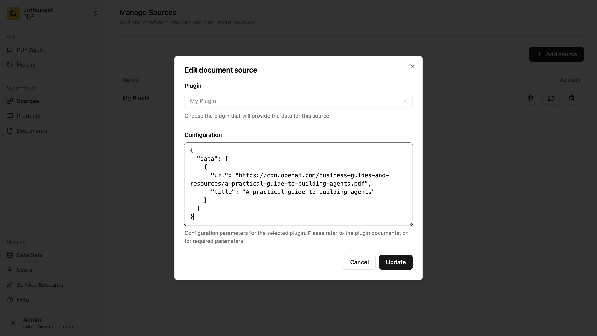

# Creating custom Plugin

Custom source plugins will allow you to insert data in any way you like.

## Creating a simple document plugin - which will allow to insert pdf documents into database and create embeddings.
1. Add needed dependencies:

``` bash
poetry add langchain-community pypdf
```

2. Next, create a new file and add plugin class
```python
import logging
from pathlib import Path

import requests
from enthusiast_common import DocumentSourcePlugin, DocumentDetails
from langchain_community.document_loaders import PyPDFLoader

logger = logging.getLogger(__name__)

class PDFDocumentSourcePlugin(DocumentSourcePlugin):
    def __init__(self, data_set_id: int, config: dict):
        super().__init__(data_set_id, config)

    def fetch(self) -> list[DocumentDetails]:
        results = []
        data = self.config.get("data", [])

        for document in data:
            url = document.get("url")
            title = document.get("title")
            try:
                response = requests.get(url)
                response.raise_for_status()

                temp_path = Path(f"/tmp/temp.pdf")
                with open(temp_path, "wb") as f:
                    f.write(response.content)

                loader = PyPDFLoader(str(temp_path))
                for index, page in enumerate(loader.lazy_load()):
                    results.append(DocumentDetails(url=f"{url}/{index}", title=title, content=page.page_content))
                return results

            except Exception as e:
                logger.error(f"Failed to load {url} ({title}): {e}")
```
3. To enable new plugin, add it to settings_override.py:
```python
CATALOG_DOCUMENT_SOURCE_PLUGINS = {
    "PDF Plugin": "<path_to_file>.PDFDocumentSourcePlugin"
}
```
Now this custom plugin will be available in Document source section.
`config` variable used in above example could be provided while adding any source plugin:

in this example it was used to provide urls to documents.

