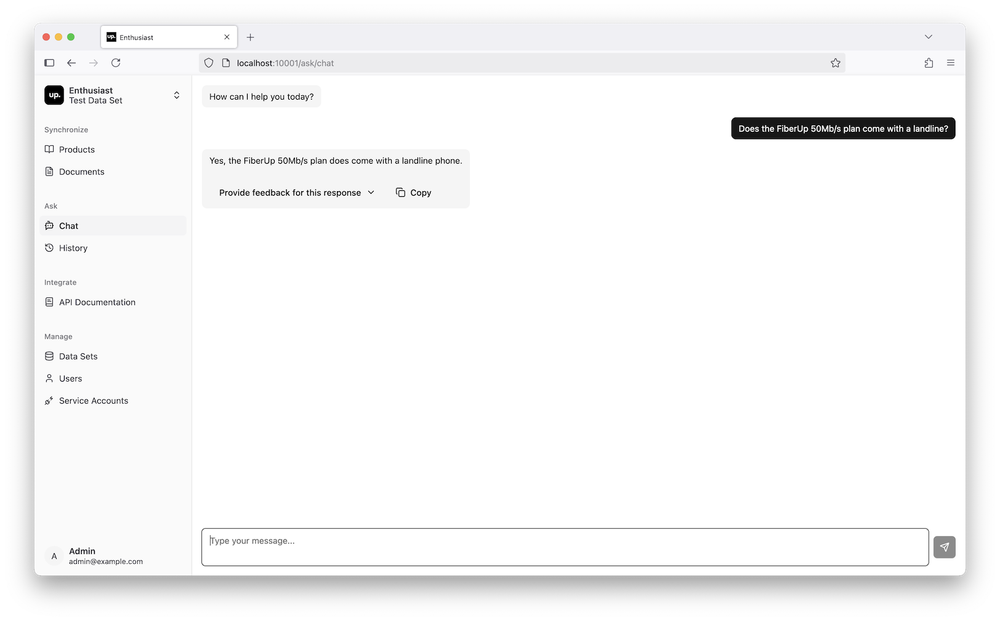

# Chat with the Catalog

Once the test data set has been imported and indexed, you can start querying it.

In the left sidebar, go to “Ask” → “Chat”. This will open the chat interface, where you can interact with the AI agent.

**Here are a few sample requests to try:**

> "Does the FiberUp 50 plan come with a landline phone plan?"

> "Write an ad for a FiberUp 100 special Christmas offer, that discounts the monthly price by 20% for the first year."

> "Respond to the following customer question: What channels are available in the FiberUp 50 package?"

> "Respond to the following customer question: Will I get roaming charges if I go to Switzerland with MobileUp Unlimited plan?"

## Next Steps

- [Learn more about data sets](/tools/enthusiast/docs/synchronize/manage-data-sets)
- [See how to manage users](/tools/enthusiast/docs/manage/manage-users)
- [Add custom tools for the AI agent](/tools/enthusiast/docs/chat/add-custom-tools)
