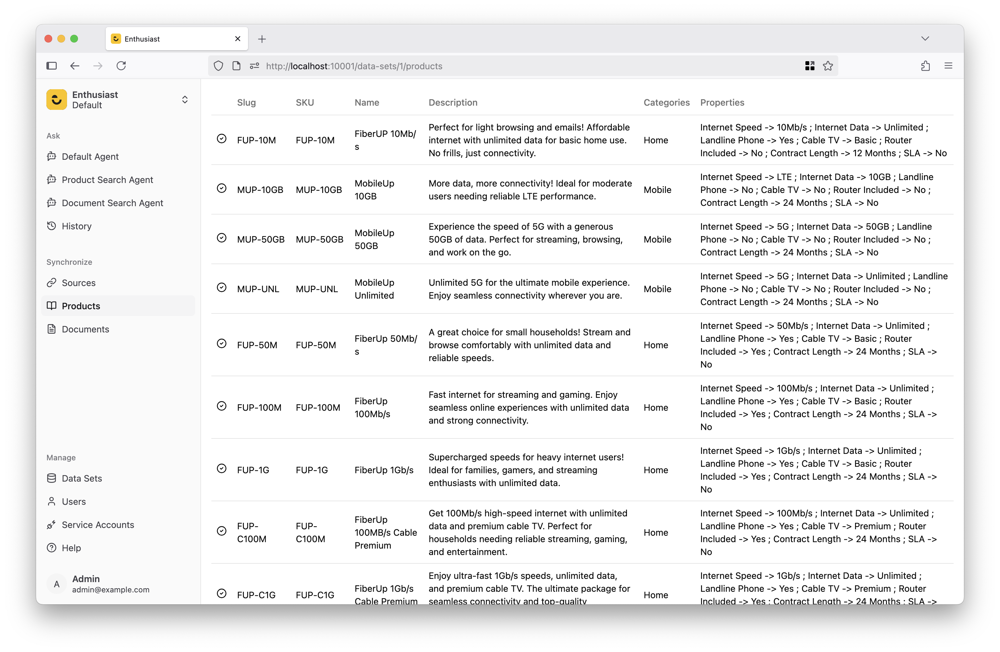

# Importing Test Data

When you sign in to Enthusiast for the first time, you’ll be prompted to create your first [data set](/tools/enthusiast/docs/synchronize/manage-data-sets).

Enter “Test Data Set” and click “Create”. This will take you to a screen where you can configure product and document sources.

:::info
While you can set up a real integration, such as Shopify, you can use the test data set provided by Enthusiast to get started quickly.
:::

Select “Sample Product Source” from the list and click “Add.” It will appear in the list below. Click “Sync” to start a manual sync and import products into Enthusiast.

Wait for the data to finish indexing. Go to the “Products” tab in the left menu and check that the products appear in the list. Repeat this step for documents.

Repeat the process for documents by selecting “Sample Document Source.”

Once it's ready, you can start [chatting with your catalog](/tools/enthusiast/docs/getting-started/chat-with-catalog).
