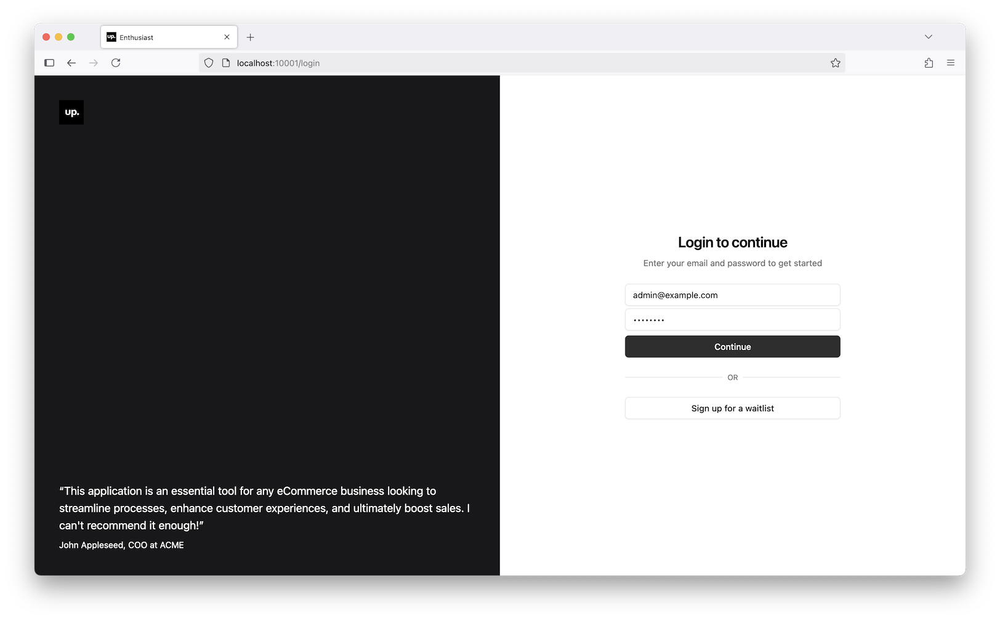

# Installation

The quickest way to start using Enthusiast is with the provided Docker Compose setup. This will get you a working instance in just a few minutes.

## Setting up using Docker Compose

First, clone the starter repository:

```shell
$ git clone https://github.com/upsidelab/enthusiast-starter
$ cp config/env.sample config/env
```

:::info
The default configuration uses the OpenAI API for generating document embeddings and for the large language model. Make sure that your OpenAI has access to gpt-4o it is default recommended model if not - at least gpt-4o-mini to ensure proper work of the application.
You need to provide your OpenAI API key via the OPENAI_API_KEY environment variable in the `config/env` file.
:::

Next, run Docker Compose to start the environment:

import Tabs from '@theme/Tabs';
import TabItem from '@theme/TabItem';

<Tabs>
  <TabItem value="macos-linux" label="macOS/Linux" default>
    ```bash
    $ docker compose build && docker compose up
    ```
  </TabItem>
  <TabItem value="windows" label="Windows">
    ```powershell
    $ docker-compose build
    $ docker-compose up
    ```
  </TabItem>
</Tabs>


Once the setup is complete, you can access the application UI at [http://localhost:10001](http://localhost:10001).



Sign in using the default admin account:

**Email**: admin@example.com

**Password**: changeme

:::note
To customize the default email and password, set the ECL_ADMIN_EMAIL and ECL_ADMIN_PASSWORD environment variables when running Docker Compose for the first time.
:::
You can now [import test data](/tools/enthusiast/docs/getting-started/import-test-data).
